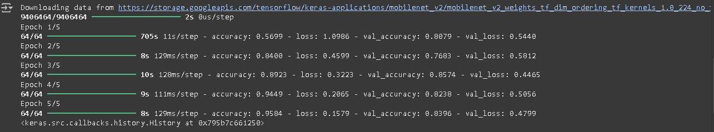
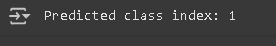

# ♻️ Edge AI Prototype: Recyclable Item Classifier

## 📘 Introduction

As global waste continues to rise, efficient and intelligent recycling is becoming a critical part of sustainable development. This project demonstrates an **Edge AI prototype** that can classify recyclable items using a lightweight deep learning model optimized for **on-device inference**.

The model is built and tested in **Google Colab** and converted to **TensorFlow Lite** for deployment on **low-resource edge devices** such as a Raspberry Pi. This approach reduces latency, enhances data privacy, and allows offline operation — ideal for real-world deployment in smart bins or recycling facilities.

---

## ❗ Problem Statement

Urban and rural waste management systems often struggle to sort recyclable materials effectively, leading to high contamination rates and reduced recycling efficiency. Manual sorting is error-prone, time-consuming, and not scalable.

**Goal:** Train an image classification model that can accurately recognize six types of recyclable waste — cardboard, glass, metal, paper, plastic, and trash — and deploy it on edge devices to automate the sorting process.

---

## 🔍 Approach

### Dataset
- Images of recyclable items stored in `/content/drive/MyDrive/dataset-resized`
- Six classes: `cardboard`, `glass`, `metal`, `paper`, `plastic`, `trash`

### Model Architecture
- **Base model:** MobileNetV2 (pretrained on ImageNet)
- **Classification head:** Global Average Pooling + Dense layers
- **Output:** 6-class softmax prediction

### Training
- Dataset split: 80% training, 20% validation
- Image preprocessing: resized to `224x224`, normalized using `Rescaling(1./255)`
- Optimizer: `Adam`, Loss: `sparse_categorical_crossentropy`
- Trained for 5 epochs on Google Colab

### Evaluation
- Final validation accuracy is printed after training


### Conversion to Edge Format
- Trained model is converted to **TensorFlow Lite (.tflite)** format
- Saved locally as `recyclable_classifier.tflite`
- Finally it predicted the class

---

## 🚀 Deployment Steps

### ✅ On Google Colab
1. Upload dataset to Google Drive in subfolders by class
2. Mount Google Drive and run the training script
3. Export the trained model to TFLite
4. Save the model to your drive or local machine

### ✅ On Raspberry Pi or Edge Device
1. Install TensorFlow Lite runtime:
   ```bash
   pip install tflite-runtime
2. Load recyclable_classifier.tflite in your Python script

3. Capture or load an image, preprocess it (resize to 224x224 and normalize)

4. Run inference using TensorFlow Lite Interpreter

5. Use the predicted class to trigger hardware (e.g., servo motor to sort)

